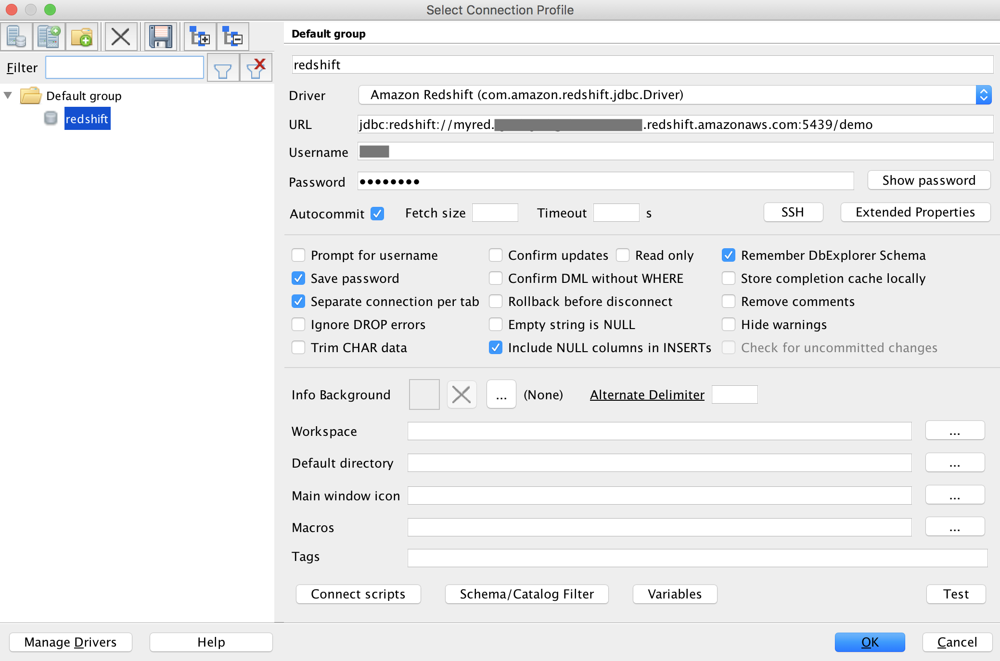
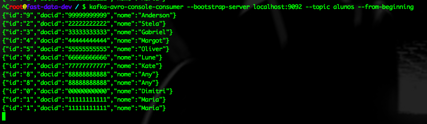
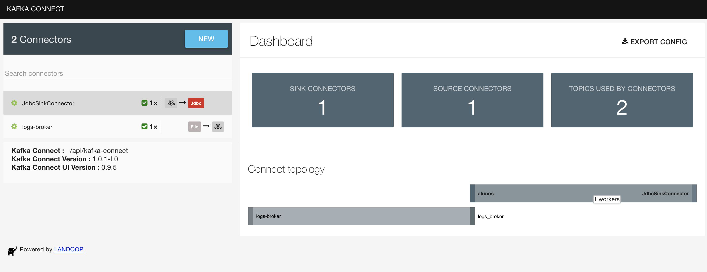

# Using Kafka connect to sink to AWS RedShift
References: 

* <https://github.com/asantos2000/kafka-connect-dynamodb>
* <https://github.com/asantos2000/kafka-connect-dynamo-oracle>

## Connect AWS Redshift
Ref: <https://docs.aws.amazon.com/redshift/latest/mgmt/connecting-using-workbench.html>



`java -jar /Applications/SQLWorkbenchJ.app/Contents/Java/sqlworkbench.jar`

## Creating Redshift table

```sql
CREATE TABLE ALUNOS (ID VARCHAR2(10)  PRIMARY KEY, DOCID VARCHAR2(11), NOME VARCHAR2(100));
```

### Installing Redshift JDBC

1. Go to AWS web site: [Faça download do driver de JDBC para Amazon Redshift](https://docs.aws.amazon.com/pt_br/redshift/latest/mgmt/configure-jdbc-connection.html)
2. Download `RedshiftJDBC42-1.x.jar`
3. Copy RedshiftJDBC42-1.x.jar to `./connect` folder;

### Start kafka

```bash
kafka-start.sh
``` 

## Configure connector
Ref: <https://docs.confluent.io/current/connect/connect-jdbc/docs/index.html>

Open the UI, and choose [Connectors](http://localhost:3030/kafka-connect-ui)

Hit the [New](http://localhost:3030/kafka-connect-ui/#/cluster/fast-data-dev/select-connector) button and copy and paste the following configuration:

Edit your DB credentials.

```ìni
name=redshift-sink
connector.class=io.confluent.connect.jdbc.JdbcSinkConnector
tasks.max=1
topics=alunos
table=alunos
connection.url=jdbc:redshift://myred.somechars.region.redshift.amazonaws.com:5439/demo?user=zeus&password=Zeus1234
auto.create=false
secret.key=[hiden]
access.key.id=[hiden]
auto.create=true
```
> Go to Redshift dashboard and obtain info below:
> cluster url (cluster, database, port, ...), master user and password

Hit [Create] if there are no red error messages.

Or use curl (or postman) to send the configuration:

```bash
curl -X POST \
  http://localhost:3030/api/kafka-connect/connectors \
  -H 'Content-Type: application/json' \
  -H 'Accept: application/json' \
  -d '{
  "name": "JdbcSinkConnector",
  "config": {
    "connector.class": "io.confluent.connect.jdbc.JdbcSinkConnector",
    "topics": "TopicName_JdbcSinkConnector",
    "tasks.max": 1,
    "connection.url": "jdbc:redshift://myred.somechars.region.redshift.amazonaws.com:5439/demo?user=zeus&"
  }
}'

## Producing some messages

Run `shell.sh` or `docker exec -it kafka bash` to get in the container and run:

```bash
# Producer

kafka-avro-console-producer --broker-list localhost:9092 --topic alunos --property value.schema='{"type":"record","name":"aluno","fields":[{"name":"id","type":"string"},{"name":"docid","type":"string"},{"name":"nome", "type": "string"}]}'

{"id":"1","docid":"11111111111","nome":"Maria"}
{"id":"2","docid":"22222222222","nome":"Stela"}
{"id":"3","docid":"33333333333","nome":"Gabriel"}
{"id":"4","docid":"44444444444","nome":"Margot"}
{"id":"5","docid":"55555555555","nome":"Oliver"}
{"id":"6","docid":"66666666666","nome":"Lune"}
{"id":"7","docid":"77777777777","nome":"Kate"}
{"id":"8","docid":"88888888888","nome":"Any"}
{"id":"9","docid":"99999999999","nome":"Anderson"}
{"id":"0","docid":"00000000000","nome":"Dimitri"}

# Consumer
kafka-avro-console-consumer --bootstrap-server localhost:9092 --topic alunos --from-beginning
```



On Kafka UI Topics



Enjoy!!